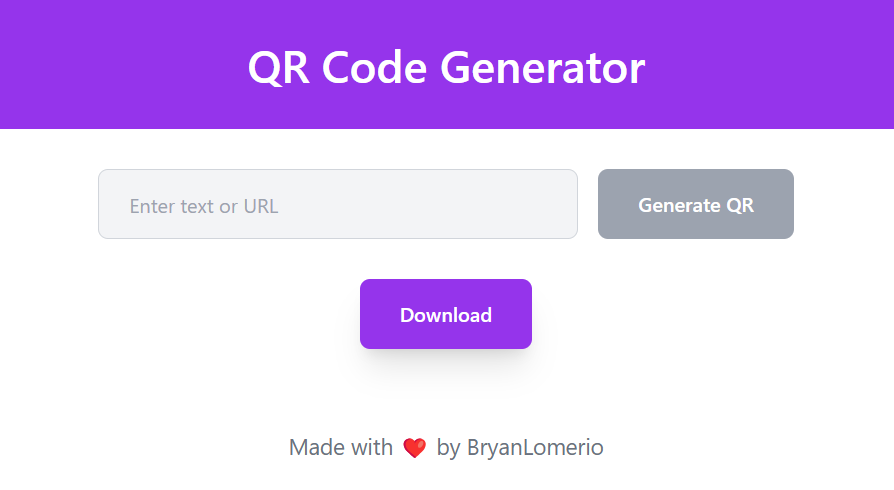
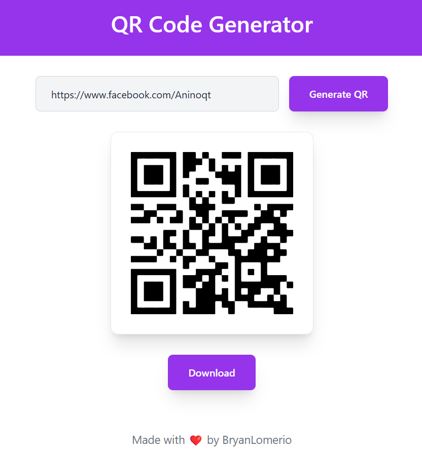
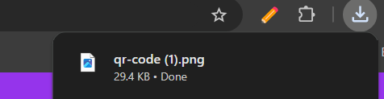
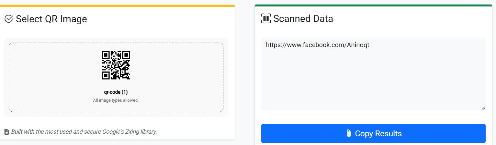

# 🌟 QR Code Generator  

## 📄 Description  

This QR Code Generator is a project I created to practice my skills in **React.js** and working with web elements. It lets users enter text, generate a QR code, and download it as an image.  

I built this project to get better at using **React.js**, managing state, and working with tools like `html-to-image` for saving images. It’s a hands-on way for me to improve my web development skills.  

🌐 **[Live Demo](https://q-rcode-ashen.vercel.app/)**  
---  

## 🛠️ Tech Stack  

- **React.js**: ⚛️ Frontend framework for building interactive UIs.  
- **Tailwind CSS**: 🎨 Utility-first framework for designing responsive layouts.  
- **JavaScript**: 💻 Programming language for logic and functionality.  

---  

## 🚀 How It Works  

1. **First Load**  
   This is the initial view when the app loads:  
     

2. **Enter Any Input**  
   You can enter any text, link, or information you want to encode into the QR code. Then click the generate button:  
     

3. **Download Image**  
   Once the QR code is generated, click the download button to save it as an image:  
     

4. **Test It Out**  
   Use any QR scanner to scan the generated QR code and see the encoded information:  
     

---  

Made with ❤️ by **Bryan Lomerio**  
